# OOPS UML Editor Design Documentation

> Note: I do not have the referenced video in the workspace or conversation, so this document is based on the behavior implemented in the Java source code.

## 1. Class Diagram With Methods and Key Attributes

```mermaid
classDiagram
    direction LR

    class Main {
        -JPanel buttonPanel
        -CanvasPanel canvasPanel
        -JButton lastActiveButton
        -JButton previousActiveButton
        +main(String[] args)$ void
        +Main()
        -initializeComponents() void
        -setupMenuBar() void
        -showLabelDialog() void
        -setButtonActive(JButton button, boolean active) void
        -clearButtonStates() void
        -activateTool(JButton button) void
    }

    class ToolButtonHandler {
        -JButton button
        +mousePressed(MouseEvent e) void
        +mouseReleased(MouseEvent e) void
    }

    class CanvasPanel {
        -int MIN_SIZE$
        -List~UMLObject~ objects
        -List~Line~ lines
        -List~UMLObject~ selectedObjects
        -String currentMode
        -UMLObject hoverObject
        -Point lastMousePoint
        -Rectangle rubberBandRect
        -Port linkStartPort
        -UMLObject resizeObject
        -boolean movingSelection
        +CanvasPanel()
        +createShapeAt(String mode, Point point) void
        +setCurrentMode(String mode) void
        +getCurrentMode() String
        +getSelectedShapes() List~UMLObject~
        +groupSelected() void
        +ungroupSelected() void
        #paintComponent(Graphics g) void
        -drawSelection(Graphics2D g2d, UMLObject object) void
        -drawLine(Graphics2D g2d, Line line) void
        -drawTriangle(Graphics2D g2d, Point end, double angle, int size, boolean filled) void
        -drawDiamond(Graphics2D g2d, Point end, double angle, int size) void
        -drawAssociationArrow(Graphics2D g2d, Point end, double angle, int size) void
        -findPortAt(Point point) Port
        -findObjectAt(Point point) UMLObject
        -bringToFront(UMLObject object) void
        -nextBackDepth() int
        -normalizeDepths() void
        -getOppositeAnchor(UMLObject object, Port port) Point
        -selectSingle(UMLObject object) void
        -clearTemporaryState() void
    }

    class MouseHandler {
        +mousePressed(MouseEvent e) void
        +mouseDragged(MouseEvent e) void
        +mouseReleased(MouseEvent e) void
        +mouseMoved(MouseEvent e) void
        -isLineMode() boolean
    }

    class UMLObject {
        <<interface>>
        +draw(Graphics2D g2d) void
        +contains(Point p) boolean
        +getBounds() Rectangle
        +move(int dx, int dy) void
        +getName() String
        +setName(String name) void
        +getLabelColor() Color
        +setLabelColor(Color color) void
        +getPorts() List~Port~
        +getNearestPort(Point p) Port
        +resize(Port port, Point anchor, Point draggedPoint, int minSize) void
        +getDepth() int
        +setDepth(int depth) void
    }

    class AbstractUMLObject {
        <<abstract>>
        #int PORT_SIZE$
        #int x
        #int y
        #int width
        #int height
        #String name
        #Color labelColor
        #int depth
        -List~Port~ ports
        #AbstractUMLObject(int x, int y, int width, int height, String name)
        #AbstractUMLObject(int x, int y, int width, int height, String name, int portCount)
        +getBounds() Rectangle
        +move(int dx, int dy) void
        +getName() String
        +setName(String name) void
        +getLabelColor() Color
        +setLabelColor(Color color) void
        +getPorts() List~Port~
        +getNearestPort(Point p) Port
        +resize(Port port, Point anchor, Point draggedPoint, int minSize) void
        +resizeFromBounds(Rectangle originalBounds, Port port, Point anchor, Point draggedPoint, int minSize) void
        +getDepth() int
        +setDepth(int depth) void
        +drawSelection(Graphics2D g2d) void
        #drawCenteredName(Graphics2D g2d, Rectangle area) void
    }

    class ClassObject {
        +ClassObject(int x, int y)
        +draw(Graphics2D g2d) void
        +contains(Point p) boolean
    }

    class UseCaseObject {
        +UseCaseObject(int x, int y)
        +draw(Graphics2D g2d) void
        +contains(Point p) boolean
    }

    class CompositeShape {
        -List~UMLObject~ children
        -int depth
        +CompositeShape(List~UMLObject~ children)
        +getChildren() List~UMLObject~
        +draw(Graphics2D g2d) void
        +drawSelection(Graphics2D g2d) void
        +contains(Point p) boolean
        +getBounds() Rectangle
        +move(int dx, int dy) void
        +getName() String
        +setName(String name) void
        +getLabelColor() Color
        +setLabelColor(Color color) void
        +getPorts() List~Port~
        +getNearestPort(Point p) Port
        +resize(Port port, Point anchor, Point draggedPoint, int minSize) void
        +getDepth() int
        +setDepth(int depth) void
    }

    class Port {
        -int HIT_SIZE$
        -UMLObject parentShape
        -int type
        -int x
        -int y
        +Port(UMLObject parentShape, int type)
        +updatePosition() void
        +contains(int mx, int my) boolean
        +getLocation() Point
        +getX() int
        +getY() int
        +getParentShape() UMLObject
        +getType() int
    }

    class Line {
        -Port start
        -Port end
        -String type
        +Line(Port start, Port end, String type)
        +getStart() Port
        +getEnd() Port
        +getType() String
        +setStart(Port start) void
        +setEnd(Port end) void
        +setType(String type) void
    }

    class ToolMode {
        <<enumeration>>
        SELECT
        ASSOCIATION
        GENERALIZATION
        COMPOSITION
        CLASS
        USE_CASE
        -String label
        +getLabel() String
        +isLineMode() boolean
        +isShapeMode() boolean
    }

    JFrame <|-- Main
    MouseAdapter <|-- ToolButtonHandler
    JPanel <|-- CanvasPanel
    MouseAdapter <|-- MouseHandler
    UMLObject <|.. AbstractUMLObject
    AbstractUMLObject <|-- ClassObject
    AbstractUMLObject <|-- UseCaseObject
    UMLObject <|.. CompositeShape
    Main *-- CanvasPanel
    Main *-- ToolButtonHandler
    CanvasPanel *-- MouseHandler
    CanvasPanel o-- UMLObject
    CanvasPanel o-- Line
    AbstractUMLObject *-- Port
    Port --> UMLObject
    Line --> Port
    CompositeShape o-- UMLObject
```

## 2. Method Behavior Summary

### Main

| Method | Behavior |
|---|---|
| `main(String[] args)` | Starts the Swing application on the Event Dispatch Thread and displays `Main`. |
| `Main()` | Configures the main window, initializes the canvas/tool buttons/menu bar, and lays out the UI. |
| `initializeComponents()` | Creates `CanvasPanel`, creates the six tool buttons, attaches handlers, and sets `select` as the initial active tool. |
| `setupMenuBar()` | Builds the `File` and `Edit` menus; wires `Group`, `Ungroup`, and `Label` to canvas/editor actions. |
| `showLabelDialog()` | Allows editing one selected basic object's name and label color; rejects zero/multiple selections and `CompositeShape`. |
| `setButtonActive(...)` | Changes a tool button's foreground/background to show active or inactive state. |
| `clearButtonStates()` | Resets all tool buttons to inactive style. |
| `activateTool(...)` | Activates a non-shape tool and updates `CanvasPanel.currentMode`. |
| `ToolButtonHandler.mousePressed(...)` | Handles tool selection; `rect` and `oval` are temporary drag/release tools, while line/select tools stay active. |
| `ToolButtonHandler.mouseReleased(...)` | Creates a class/use-case object if `rect` or `oval` is released over the canvas, then restores the previous tool. |

### CanvasPanel

| Method | Behavior |
|---|---|
| `CanvasPanel()` | Registers `MouseHandler` for click, drag, release, and move events; makes the panel focusable. |
| `createShapeAt(...)` | Creates `ClassObject` for `rect` or `UseCaseObject` for `oval`, sets depth, adds it to `objects`, and repaints. |
| `setCurrentMode(...)` | Updates the active tool mode, clears temporary interaction state, and repaints. |
| `getCurrentMode()` | Returns the current tool mode string. |
| `getSelectedShapes()` | Returns the current selected object list. |
| `groupSelected()` | If in select mode with at least two selected objects, replaces them with a `CompositeShape`. |
| `ungroupSelected()` | If exactly one selected object is a `CompositeShape`, removes the group and restores its children. |
| `paintComponent(...)` | Redraws all UML objects, lines, selection/hover handles, rubber-band box, and line preview. |
| `drawSelection(...)` | Delegates selection drawing to `CompositeShape` or `AbstractUMLObject`. |
| `drawLine(...)` | Draws the line body and the correct arrow head based on type. |
| `drawTriangle(...)` | Draws the hollow triangle arrow head for generalization. |
| `drawDiamond(...)` | Draws the filled diamond arrow head for composition. |
| `drawAssociationArrow(...)` | Draws a V-shaped arrow head for association. |
| `findPortAt(...)` | Searches top-to-bottom for a non-composite object's port under the mouse point. |
| `findObjectAt(...)` | Searches top-to-bottom for the object under the mouse point. |
| `bringToFront(...)` | Moves an object to the end of `objects`, gives it front depth, then normalizes depths. |
| `nextBackDepth()` | Returns the depth used for newly-created objects. |
| `normalizeDepths()` | Reassigns depths based on drawing order. |
| `getOppositeAnchor(...)` | Finds the fixed opposite anchor point used while resizing from a port. |
| `selectSingle(...)` | Clears current selection, selects one object, and brings it to the front. |
| `clearTemporaryState()` | Clears hover, rubber-band, link-preview, resize, and move state. |
| `MouseHandler.mousePressed(...)` | Starts line creation, resize, move, single selection, or rubber-band selection depending on mode and hit target. |
| `MouseHandler.mouseDragged(...)` | Updates line preview, resizes object, moves selected objects, or updates rubber-band rectangle. |
| `MouseHandler.mouseReleased(...)` | Completes line creation or rubber-band selection, clears interaction state, and repaints. |
| `MouseHandler.mouseMoved(...)` | Updates hover object and cursor in select mode. |
| `MouseHandler.isLineMode()` | Returns true for `association`, `generalization`, and `composition`. |

### UMLObject Interface

| Method | Behavior |
|---|---|
| `draw(...)` | Draws the object on the canvas. |
| `contains(...)` | Tests whether a mouse point hits the object. |
| `getBounds()` | Returns the object's rectangular bounds. |
| `move(...)` | Moves the object by a delta. |
| `getName()` / `setName(...)` | Reads or updates the label text. |
| `getLabelColor()` / `setLabelColor(...)` | Reads or updates the label background color. |
| `getPorts()` | Returns connection/resize ports. |
| `getNearestPort(...)` | Finds the nearest port to a point. |
| `resize(...)` | Resizes the object from a dragged port. |
| `getDepth()` / `setDepth(...)` | Reads or updates drawing depth. |

### AbstractUMLObject

| Method | Behavior |
|---|---|
| Constructors | Store position, size, name, and create the requested number of `Port` objects. |
| `getBounds()` | Returns `Rectangle(x, y, width, height)`. |
| `move(...)` | Adds `dx` and `dy` to the object's position. |
| `getName()` / `setName(...)` | Gets or sets label text; null becomes an empty string. |
| `getLabelColor()` / `setLabelColor(...)` | Gets or sets label color; null becomes default light gray. |
| `getPorts()` | Returns an unmodifiable port list. |
| `getNearestPort(...)` | Compares squared distance from a point to each port location. |
| `resize(...)` | Delegates to `resizeFromBounds(...)` using current bounds. |
| `resizeFromBounds(...)` | Calculates a new rectangle from dragged port, opposite anchor, and minimum size. |
| `getDepth()` / `setDepth(...)` | Gets or sets drawing depth. |
| `drawSelection(...)` | Draws port handles and a blue selection rectangle. |
| `drawCenteredName(...)` | Draws the object label centered inside a given rectangle. |

### ClassObject

| Method | Behavior |
|---|---|
| `ClassObject(...)` | Creates a 110x70 class rectangle with 8 ports. |
| `draw(...)` | Draws a white rectangle outline and centered label. |
| `contains(...)` | Uses rectangular hit detection. |

### UseCaseObject

| Method | Behavior |
|---|---|
| `UseCaseObject(...)` | Creates a 110x70 use-case oval with 4 ports. |
| `draw(...)` | Draws a white ellipse outline and centered label. |
| `contains(...)` | Uses ellipse equation hit detection. |

### CompositeShape

| Method | Behavior |
|---|---|
| `CompositeShape(...)` | Stores a copy of the selected child objects. |
| `getChildren()` | Returns an unmodifiable child list. |
| `draw(...)` | Draws every child object. |
| `drawSelection(...)` | Draws a dashed blue rectangle around all children. |
| `contains(...)` | Uses the union bounds of all children for hit detection. |
| `getBounds()` | Returns the union rectangle of all child bounds. |
| `move(...)` | Moves every child by the same delta. |
| `getName()` / `setName(...)` | Composite labels are unsupported; returns empty string and ignores set. |
| `getLabelColor()` / `setLabelColor(...)` | Composite label color is unsupported; returns light gray and ignores set. |
| `getPorts()` / `getNearestPort(...)` | Composite connections are unsupported; returns empty/null. |
| `resize(...)` | Composite resizing is unsupported. |
| `getDepth()` / `setDepth(...)` | Gets or sets group drawing depth. |

### Port

| Method | Behavior |
|---|---|
| `Port(...)` | Stores parent object and port type/index. |
| `updatePosition()` | Calculates the port coordinate from parent bounds and port count. |
| `contains(...)` | Updates position and checks whether a mouse point is within hit range. |
| `getLocation()` | Updates position and returns it as a `Point`. |
| `getX()` / `getY()` | Updates position and returns one coordinate. |
| `getParentShape()` | Returns the object this port belongs to. |
| `getType()` | Returns the port type/index. |

### Line

| Method | Behavior |
|---|---|
| `Line(...)` | Stores start port, end port, and line type. |
| `getStart()` / `getEnd()` / `getType()` | Return line properties. |
| `setStart(...)` / `setEnd(...)` / `setType(...)` | Update line properties. |

### ToolMode

| Method | Behavior |
|---|---|
| Constructor | Stores the visible tool label. |
| `getLabel()` | Returns the tool label used by the UI. |
| `isLineMode()` | Returns true for association, generalization, and composition. |
| `isShapeMode()` | Returns true for class rectangle and use-case oval tools. |

## 3. Sequence Diagram For Each UML Editor Use Case

### Use Case 1: Start UML Editor

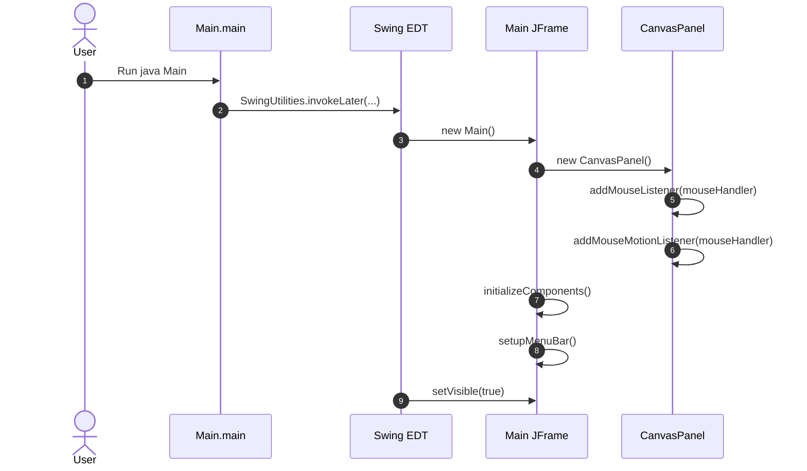
```mermaid
sequenceDiagram
    autonumber
    actor User
    participant MainThread as Main.main
    participant EDT as Swing EDT
    participant Main as Main JFrame
    participant Canvas as CanvasPanel

    User->>MainThread: Run java Main
    MainThread->>EDT: SwingUtilities.invokeLater(...)
    EDT->>Main: new Main()
    Main->>Canvas: new CanvasPanel()
    Canvas->>Canvas: addMouseListener(mouseHandler)
    Canvas->>Canvas: addMouseMotionListener(mouseHandler)
    Main->>Main: initializeComponents()
    Main->>Main: setupMenuBar()
    EDT->>Main: setVisible(true)
```

### Use Case 2: Select Tool

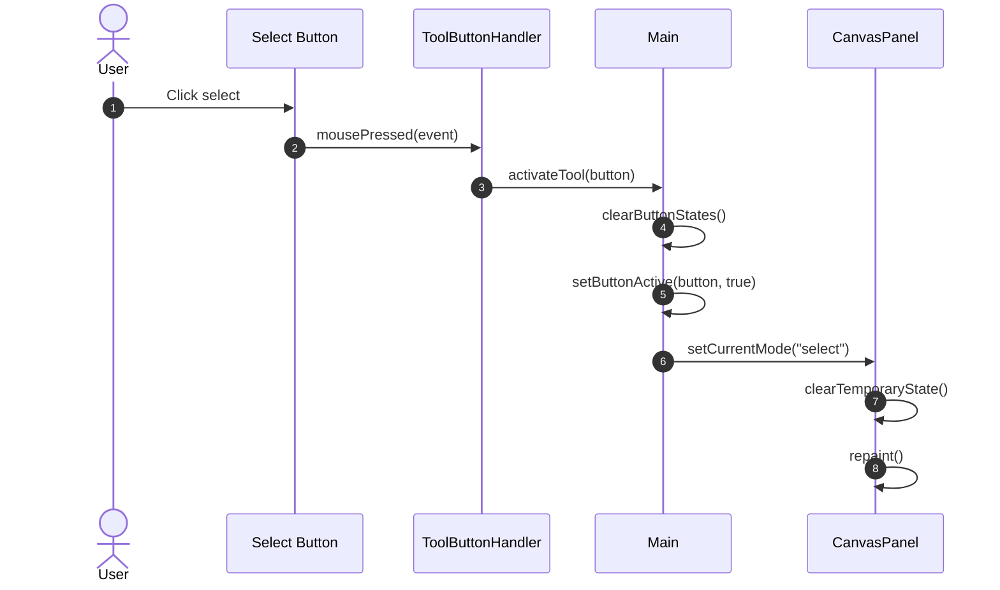
```mermaid
sequenceDiagram
    autonumber
    actor User
    participant Button as Select Button
    participant Handler as ToolButtonHandler
    participant Main as Main
    participant Canvas as CanvasPanel

    User->>Button: Click select
    Button->>Handler: mousePressed(event)
    Handler->>Main: activateTool(button)
    Main->>Main: clearButtonStates()
    Main->>Main: setButtonActive(button, true)
    Main->>Canvas: setCurrentMode("select")
    Canvas->>Canvas: clearTemporaryState()
    Canvas->>Canvas: repaint()
```

### Use Case 3: Create Class Object

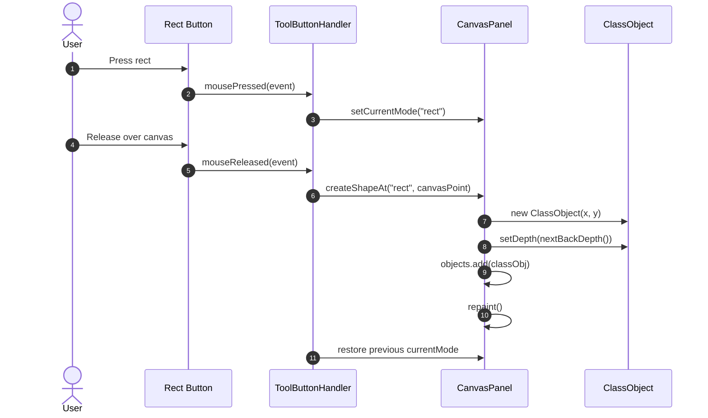
```mermaid
sequenceDiagram
    autonumber
    actor User
    participant Button as Rect Button
    participant Handler as ToolButtonHandler
    participant Canvas as CanvasPanel
    participant ClassObj as ClassObject

    User->>Button: Press rect
    Button->>Handler: mousePressed(event)
    Handler->>Canvas: setCurrentMode("rect")
    User->>Button: Release over canvas
    Button->>Handler: mouseReleased(event)
    Handler->>Canvas: createShapeAt("rect", canvasPoint)
    Canvas->>ClassObj: new ClassObject(x, y)
    Canvas->>ClassObj: setDepth(nextBackDepth())
    Canvas->>Canvas: objects.add(classObj)
    Canvas->>Canvas: repaint()
    Handler->>Canvas: restore previous currentMode
```

### Use Case 4: Create Use Case Object

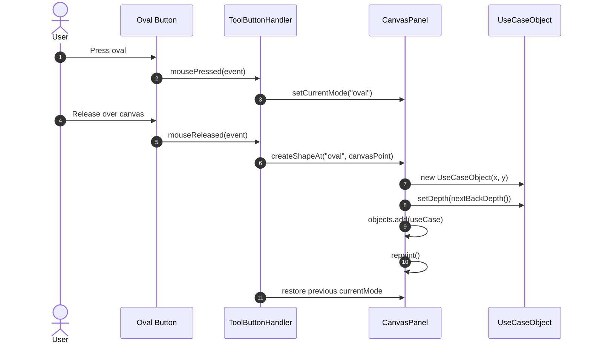
```mermaid
sequenceDiagram
    autonumber
    actor User
    participant Button as Oval Button
    participant Handler as ToolButtonHandler
    participant Canvas as CanvasPanel
    participant UseCase as UseCaseObject

    User->>Button: Press oval
    Button->>Handler: mousePressed(event)
    Handler->>Canvas: setCurrentMode("oval")
    User->>Button: Release over canvas
    Button->>Handler: mouseReleased(event)
    Handler->>Canvas: createShapeAt("oval", canvasPoint)
    Canvas->>UseCase: new UseCaseObject(x, y)
    Canvas->>UseCase: setDepth(nextBackDepth())
    Canvas->>Canvas: objects.add(useCase)
    Canvas->>Canvas: repaint()
    Handler->>Canvas: restore previous currentMode
```

### Use Case 5: Select Single Object

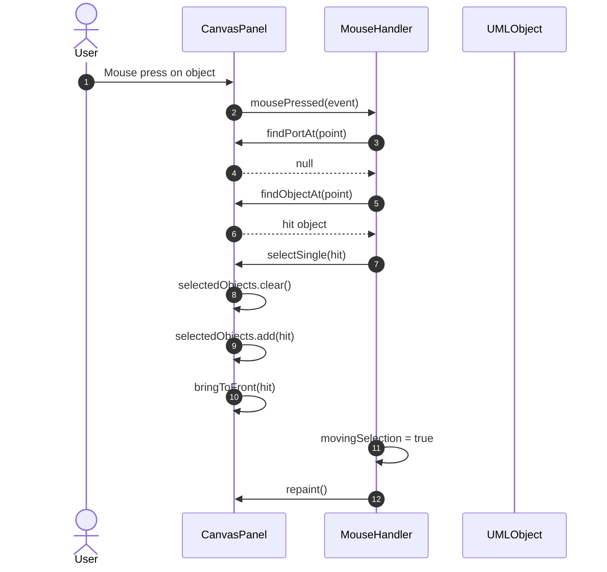
```mermaid
sequenceDiagram
    autonumber
    actor User
    participant Canvas as CanvasPanel
    participant Mouse as MouseHandler
    participant Object as UMLObject

    User->>Canvas: Mouse press on object
    Canvas->>Mouse: mousePressed(event)
    Mouse->>Canvas: findPortAt(point)
    Canvas-->>Mouse: null
    Mouse->>Canvas: findObjectAt(point)
    Canvas-->>Mouse: hit object
    Mouse->>Canvas: selectSingle(hit)
    Canvas->>Canvas: selectedObjects.clear()
    Canvas->>Canvas: selectedObjects.add(hit)
    Canvas->>Canvas: bringToFront(hit)
    Mouse->>Mouse: movingSelection = true
    Mouse->>Canvas: repaint()
```

### Use Case 6: Move Selected Object Or Group

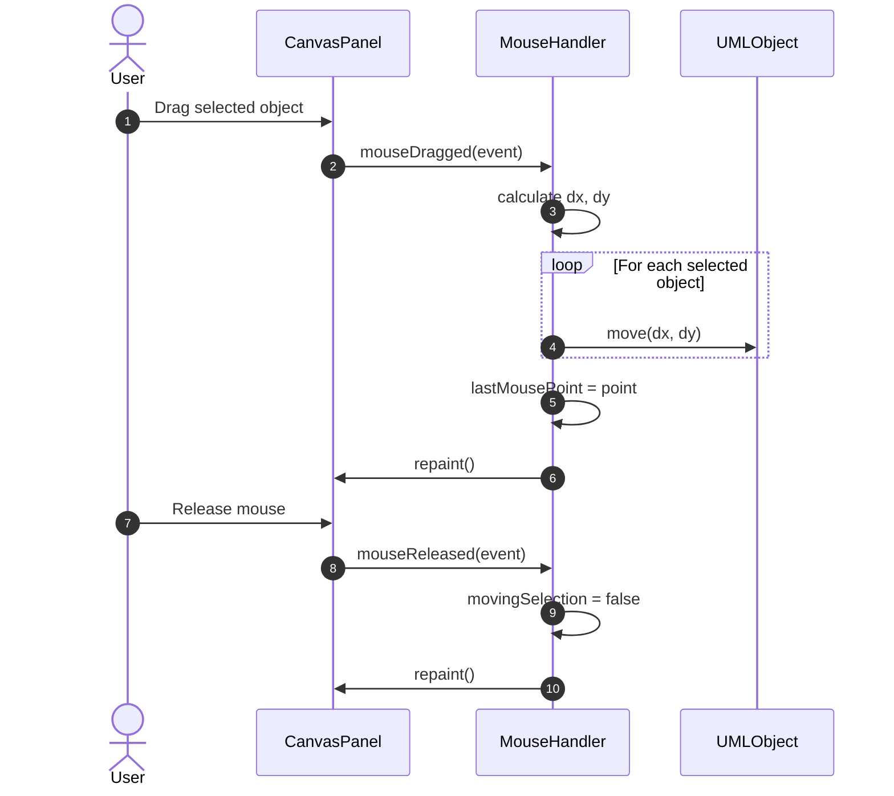
```mermaid
sequenceDiagram
    autonumber
    actor User
    participant Canvas as CanvasPanel
    participant Mouse as MouseHandler
    participant Object as UMLObject

    User->>Canvas: Drag selected object
    Canvas->>Mouse: mouseDragged(event)
    Mouse->>Mouse: calculate dx, dy
    loop For each selected object
        Mouse->>Object: move(dx, dy)
    end
    Mouse->>Mouse: lastMousePoint = point
    Mouse->>Canvas: repaint()
    User->>Canvas: Release mouse
    Canvas->>Mouse: mouseReleased(event)
    Mouse->>Mouse: movingSelection = false
    Mouse->>Canvas: repaint()
```

### Use Case 7: Rubber-Band Multi-Select

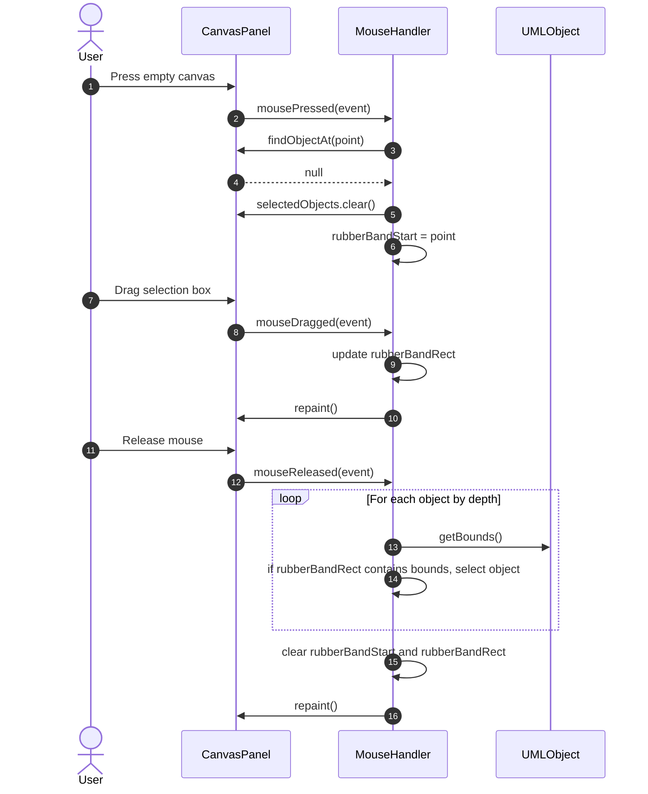
```mermaid
sequenceDiagram
    autonumber
    actor User
    participant Canvas as CanvasPanel
    participant Mouse as MouseHandler
    participant Object as UMLObject

    User->>Canvas: Press empty canvas
    Canvas->>Mouse: mousePressed(event)
    Mouse->>Canvas: findObjectAt(point)
    Canvas-->>Mouse: null
    Mouse->>Canvas: selectedObjects.clear()
    Mouse->>Mouse: rubberBandStart = point

    User->>Canvas: Drag selection box
    Canvas->>Mouse: mouseDragged(event)
    Mouse->>Mouse: update rubberBandRect
    Mouse->>Canvas: repaint()

    User->>Canvas: Release mouse
    Canvas->>Mouse: mouseReleased(event)
    loop For each object by depth
        Mouse->>Object: getBounds()
        Mouse->>Mouse: if rubberBandRect contains bounds, select object
    end
    Mouse->>Mouse: clear rubberBandStart and rubberBandRect
    Mouse->>Canvas: repaint()
```

### Use Case 8: Resize Object

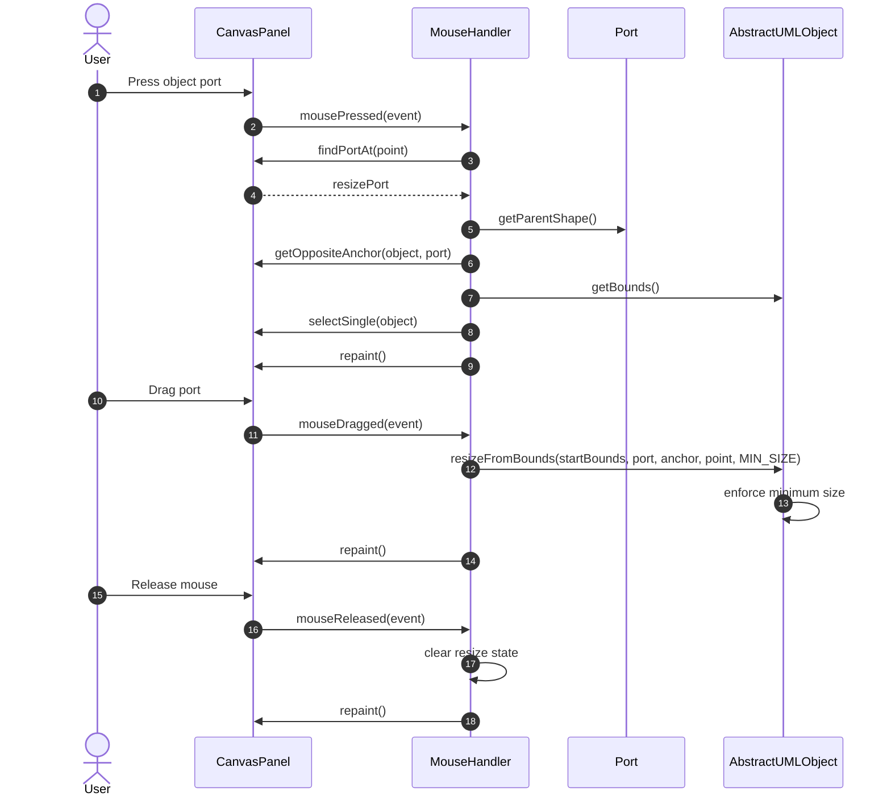
```mermaid
sequenceDiagram
    autonumber
    actor User
    participant Canvas as CanvasPanel
    participant Mouse as MouseHandler
    participant Port as Port
    participant Object as AbstractUMLObject

    User->>Canvas: Press object port
    Canvas->>Mouse: mousePressed(event)
    Mouse->>Canvas: findPortAt(point)
    Canvas-->>Mouse: resizePort
    Mouse->>Port: getParentShape()
    Mouse->>Canvas: getOppositeAnchor(object, port)
    Mouse->>Object: getBounds()
    Mouse->>Canvas: selectSingle(object)
    Mouse->>Canvas: repaint()

    User->>Canvas: Drag port
    Canvas->>Mouse: mouseDragged(event)
    Mouse->>Object: resizeFromBounds(startBounds, port, anchor, point, MIN_SIZE)
    Object->>Object: enforce minimum size
    Mouse->>Canvas: repaint()

    User->>Canvas: Release mouse
    Canvas->>Mouse: mouseReleased(event)
    Mouse->>Mouse: clear resize state
    Mouse->>Canvas: repaint()
```

### Use Case 9: Create Association Line

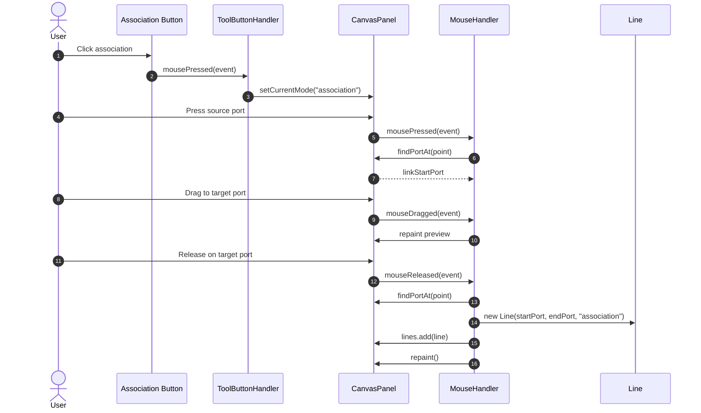
```mermaid
sequenceDiagram
    autonumber
    actor User
    participant Button as Association Button
    participant Handler as ToolButtonHandler
    participant Canvas as CanvasPanel
    participant Mouse as MouseHandler
    participant Line as Line

    User->>Button: Click association
    Button->>Handler: mousePressed(event)
    Handler->>Canvas: setCurrentMode("association")
    User->>Canvas: Press source port
    Canvas->>Mouse: mousePressed(event)
    Mouse->>Canvas: findPortAt(point)
    Canvas-->>Mouse: linkStartPort
    User->>Canvas: Drag to target port
    Canvas->>Mouse: mouseDragged(event)
    Mouse->>Canvas: repaint preview
    User->>Canvas: Release on target port
    Canvas->>Mouse: mouseReleased(event)
    Mouse->>Canvas: findPortAt(point)
    Mouse->>Line: new Line(startPort, endPort, "association")
    Mouse->>Canvas: lines.add(line)
    Mouse->>Canvas: repaint()
```

### Use Case 10: Create Generalization Line

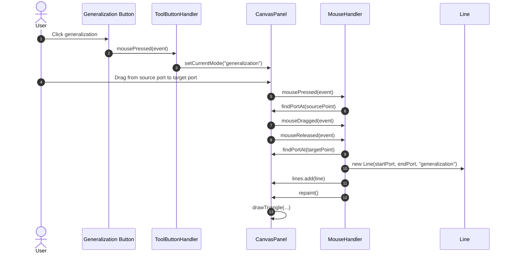
```mermaid
sequenceDiagram
    autonumber
    actor User
    participant Button as Generalization Button
    participant Handler as ToolButtonHandler
    participant Canvas as CanvasPanel
    participant Mouse as MouseHandler
    participant Line as Line

    User->>Button: Click generalization
    Button->>Handler: mousePressed(event)
    Handler->>Canvas: setCurrentMode("generalization")
    User->>Canvas: Drag from source port to target port
    Canvas->>Mouse: mousePressed(event)
    Mouse->>Canvas: findPortAt(sourcePoint)
    Canvas->>Mouse: mouseDragged(event)
    Canvas->>Mouse: mouseReleased(event)
    Mouse->>Canvas: findPortAt(targetPoint)
    Mouse->>Line: new Line(startPort, endPort, "generalization")
    Mouse->>Canvas: lines.add(line)
    Mouse->>Canvas: repaint()
    Canvas->>Canvas: drawTriangle(...)
```

### Use Case 11: Create Composition Line

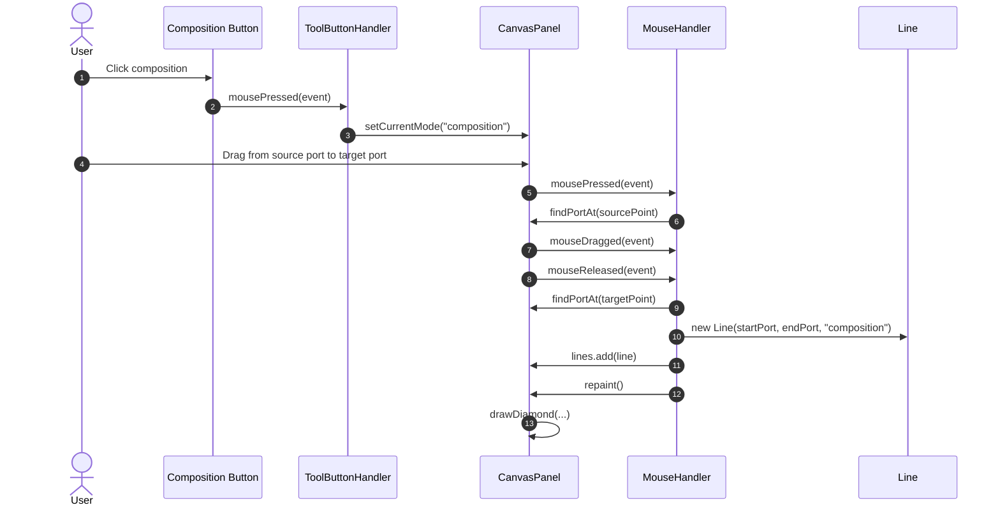
```mermaid
sequenceDiagram
    autonumber
    actor User
    participant Button as Composition Button
    participant Handler as ToolButtonHandler
    participant Canvas as CanvasPanel
    participant Mouse as MouseHandler
    participant Line as Line

    User->>Button: Click composition
    Button->>Handler: mousePressed(event)
    Handler->>Canvas: setCurrentMode("composition")
    User->>Canvas: Drag from source port to target port
    Canvas->>Mouse: mousePressed(event)
    Mouse->>Canvas: findPortAt(sourcePoint)
    Canvas->>Mouse: mouseDragged(event)
    Canvas->>Mouse: mouseReleased(event)
    Mouse->>Canvas: findPortAt(targetPoint)
    Mouse->>Line: new Line(startPort, endPort, "composition")
    Mouse->>Canvas: lines.add(line)
    Mouse->>Canvas: repaint()
    Canvas->>Canvas: drawDiamond(...)
```

### Use Case 12: Group Selected Objects

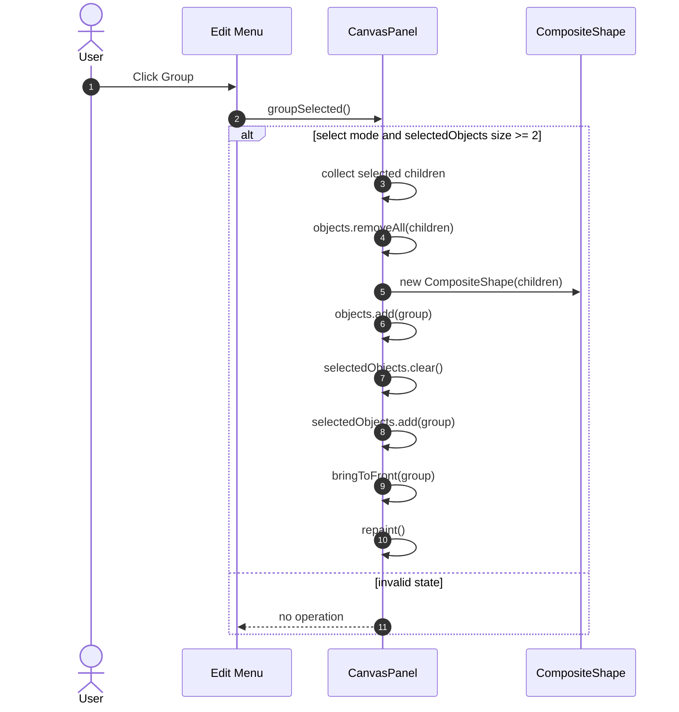
```mermaid
sequenceDiagram
    autonumber
    actor User
    participant Menu as Edit Menu
    participant Canvas as CanvasPanel
    participant Group as CompositeShape

    User->>Menu: Click Group
    Menu->>Canvas: groupSelected()
    alt select mode and selectedObjects size >= 2
        Canvas->>Canvas: collect selected children
        Canvas->>Canvas: objects.removeAll(children)
        Canvas->>Group: new CompositeShape(children)
        Canvas->>Canvas: objects.add(group)
        Canvas->>Canvas: selectedObjects.clear()
        Canvas->>Canvas: selectedObjects.add(group)
        Canvas->>Canvas: bringToFront(group)
        Canvas->>Canvas: repaint()
    else invalid state
        Canvas-->>Menu: no operation
    end
```

### Use Case 13: Ungroup Selected Group

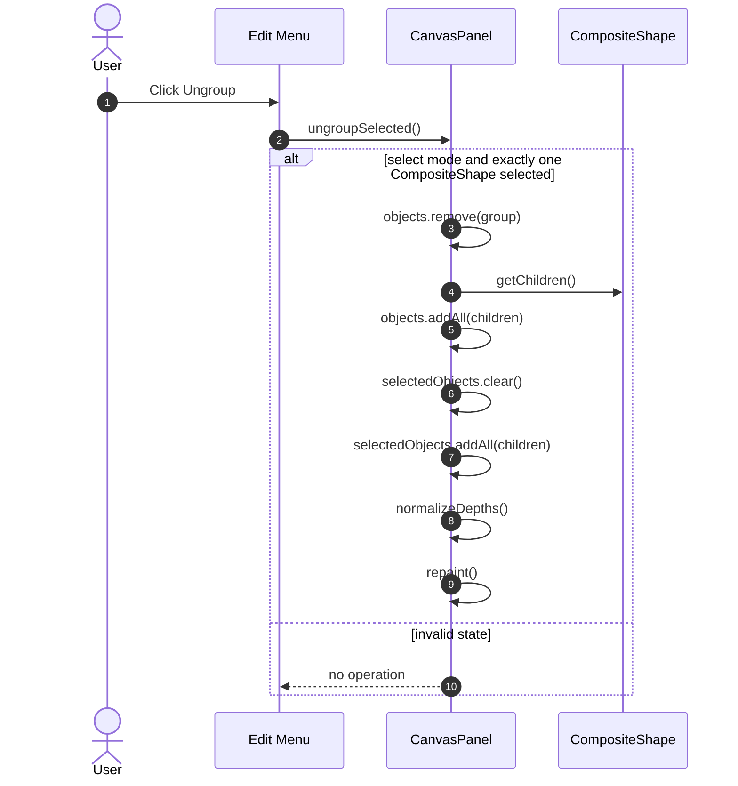
```mermaid
sequenceDiagram
    autonumber
    actor User
    participant Menu as Edit Menu
    participant Canvas as CanvasPanel
    participant Group as CompositeShape

    User->>Menu: Click Ungroup
    Menu->>Canvas: ungroupSelected()
    alt select mode and exactly one CompositeShape selected
        Canvas->>Canvas: objects.remove(group)
        Canvas->>Group: getChildren()
        Canvas->>Canvas: objects.addAll(children)
        Canvas->>Canvas: selectedObjects.clear()
        Canvas->>Canvas: selectedObjects.addAll(children)
        Canvas->>Canvas: normalizeDepths()
        Canvas->>Canvas: repaint()
    else invalid state
        Canvas-->>Menu: no operation
    end
```

### Use Case 14: Change Object Label

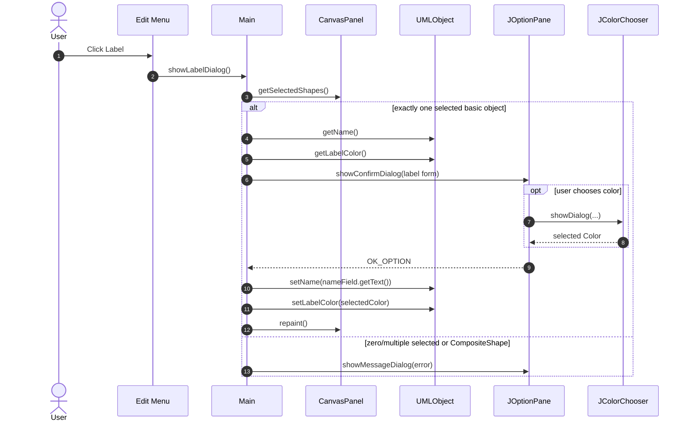
```mermaid
sequenceDiagram
    autonumber
    actor User
    participant Menu as Edit Menu
    participant Main as Main
    participant Canvas as CanvasPanel
    participant Object as UMLObject
    participant Dialog as JOptionPane
    participant ColorChooser as JColorChooser

    User->>Menu: Click Label
    Menu->>Main: showLabelDialog()
    Main->>Canvas: getSelectedShapes()
    alt exactly one selected basic object
        Main->>Object: getName()
        Main->>Object: getLabelColor()
        Main->>Dialog: showConfirmDialog(label form)
        opt user chooses color
            Dialog->>ColorChooser: showDialog(...)
            ColorChooser-->>Dialog: selected Color
        end
        Dialog-->>Main: OK_OPTION
        Main->>Object: setName(nameField.getText())
        Main->>Object: setLabelColor(selectedColor)
        Main->>Canvas: repaint()
    else zero/multiple selected or CompositeShape
        Main->>Dialog: showMessageDialog(error)
    end
```

### Use Case 15: Hover Object In Select Mode

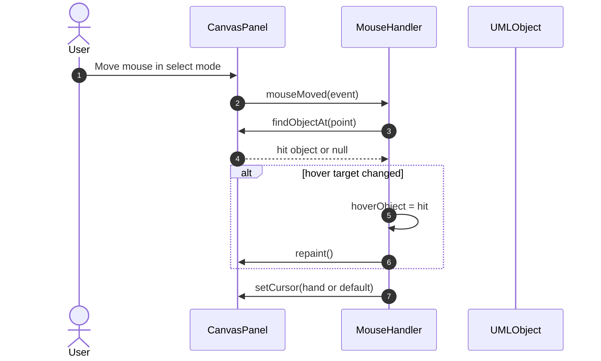
```mermaid
sequenceDiagram
    autonumber
    actor User
    participant Canvas as CanvasPanel
    participant Mouse as MouseHandler
    participant Object as UMLObject

    User->>Canvas: Move mouse in select mode
    Canvas->>Mouse: mouseMoved(event)
    Mouse->>Canvas: findObjectAt(point)
    Canvas-->>Mouse: hit object or null
    alt hover target changed
        Mouse->>Mouse: hoverObject = hit
        Mouse->>Canvas: repaint()
    end
    Mouse->>Canvas: setCursor(hand or default)
```
