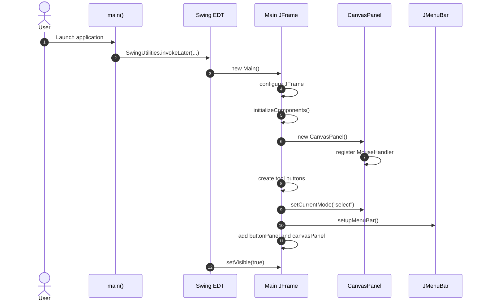
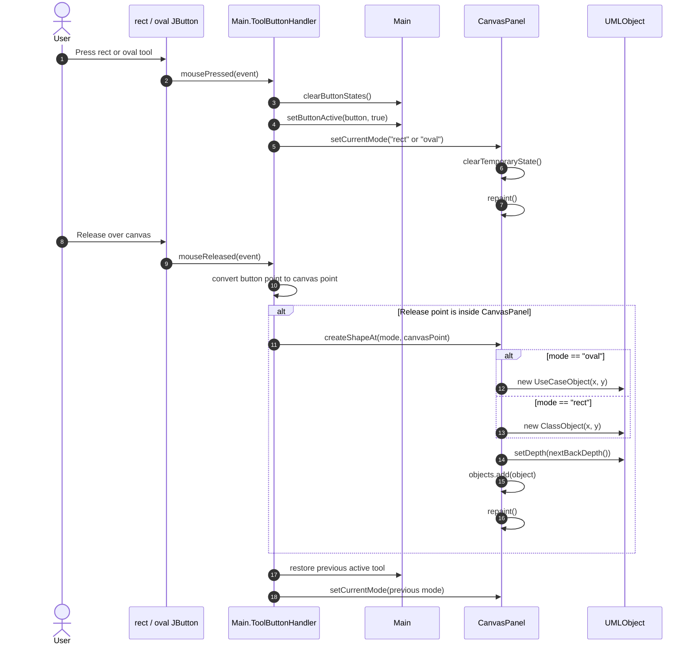
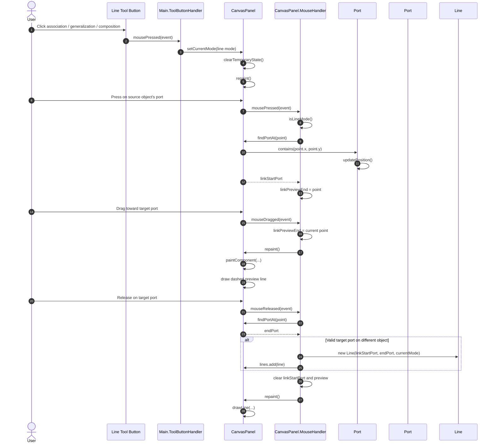
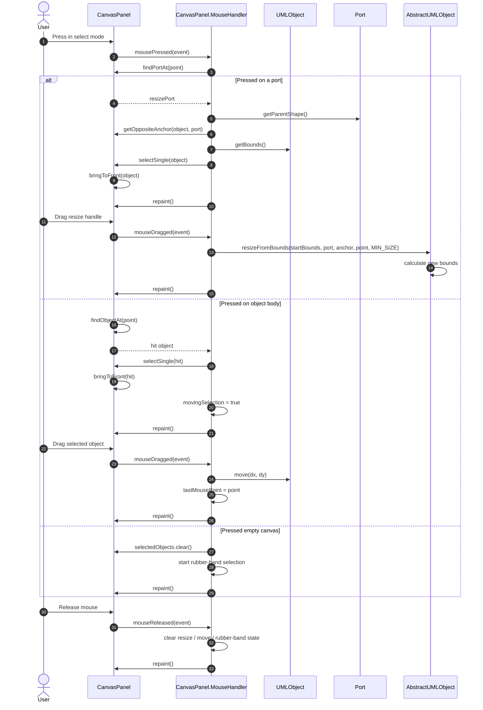
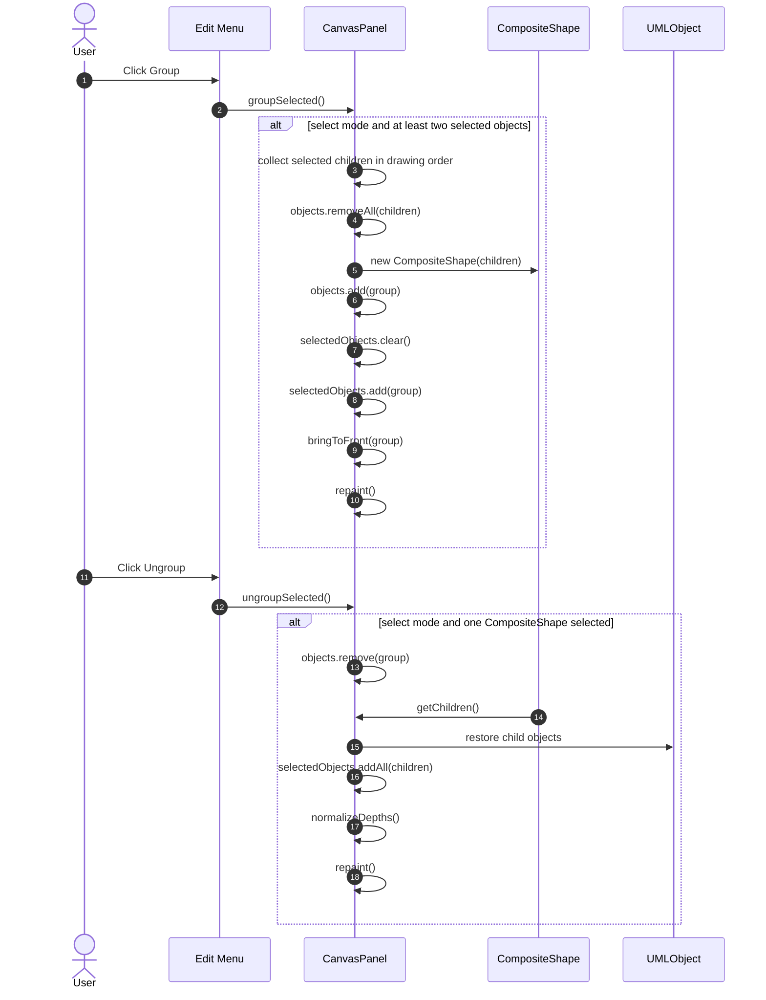
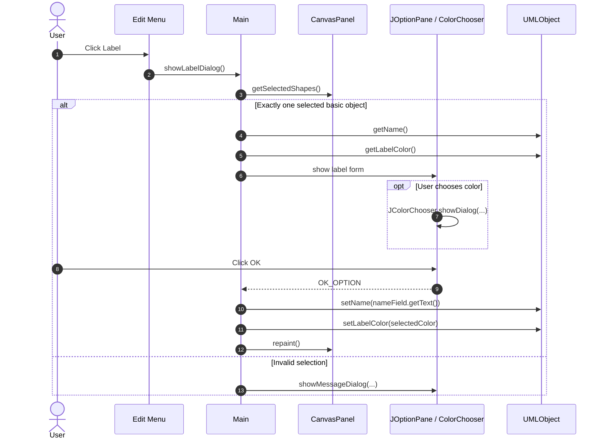

# OOPS UML Editor - Sequence Diagrams

This document summarizes the main runtime interactions in the Java Swing UML editor.

## 1. Application Startup

## 2. Create Class or Use Case Object

## 3. Create Association / Generalization / Composition Line

## 4. Select, Move, and Resize Object

## 5. Group and Ungroup

## 6. Change Object Label

